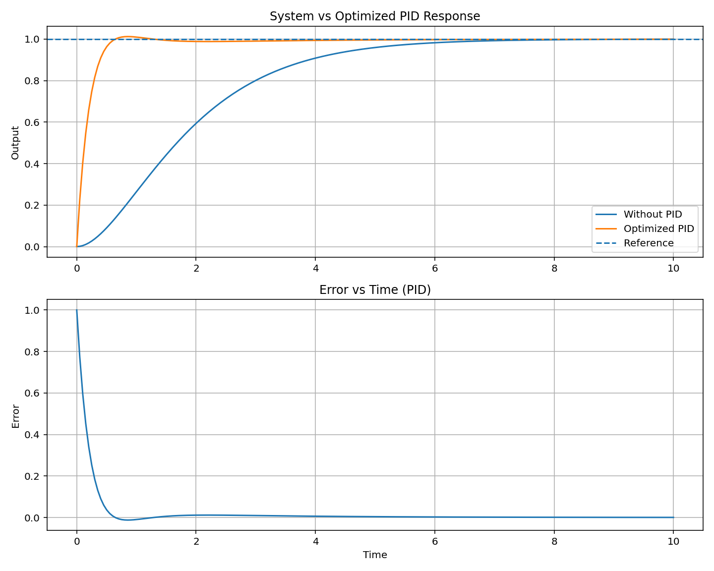

# PID Controller Auto-Tuning (Python)

This project implements automatic tuning of a PID controller using grid search optimization.
It finds optimal values of (K_p), (K_i), and (K_d) to improve system performance based on key control metrics.

---

## 📌 Overview

A Proportional-Integral-Derivative (PID) controller is widely used in control systems to regulate output response.

This project demonstrates how PID controllers can significantly improve system response by reducing rise time, settling time, and steady-state error through automated tuning.

This project:

* Accepts any transfer function as input
* Simulates system response
* Searches for the best PID parameters
* Optimizes performance automatically

---

## ⚙️ Features

* Accepts custom transfer function input
* Automatic PID tuning using grid search
* Optimization-based tuning (alternative to classical methods like Ziegler–Nichols)
* Evaluates system using:

  * Rise Time
  * Settling Time
  * Overshoot
  * Steady-state error
* Compares system behavior:

  * Without PID
  * With optimized PID
* Generates response and error plots

---

## 🧠 Methodology

The system is modeled using a transfer function:

G(s) = 1 / (s² + 2s + 1)

A PID controller is defined as:

C(s) = Kp + Ki/s + Kd·s

### Algorithm:

1. Iterate over a range of (K_p, K_i, K_d) values
2. Simulate closed-loop response
3. Compute performance metrics
4. Use a cost function to evaluate performance
5. Select parameters that minimize the cost
   
### Cost Function

The optimization minimizes a weighted sum of key performance metrics:

Cost = w1 × Settling Time + w2 × Overshoot + w3 × Steady-State Error

This ensures a balance between fast response, stability, and accuracy.

---

## 📊 Performance Comparison

### Input Transfer Function

Numerator: `1`
Denominator: `1 2 1`

### Without PID

* Rise Time: **3.367 s**
* Settling Time: **5.879 s**
* Overshoot: **0.00%**

### With Optimized PID

* Rise Time: **0.352 s**
* Settling Time: **0.553 s**
* Overshoot: **1.23%**
* Steady-state error: **0.0004**

### 🚀 Improvement

* ~10× faster rise time
* ~10× faster settling time
* Very low steady-state error
* Minimal overshoot

---

## 📈 Output

The optimized PID controller significantly improves system response compared to the uncontrolled system.

### System vs Optimized PID Response



---

## 🛠️ Technologies Used

* Python
* NumPy
* Matplotlib
* Control Systems Library (`python-control`)

---

## ▶️ How to Run

### 1. Install dependencies

```
pip install numpy matplotlib control
```

### 2. Run the script

```
python PID-Controller-Auto-Tuning.py
```

### 3. Provide input

```
Enter numerator: 1
Enter denominator: 1 2 1
```

---

## 📁 Project Structure

```
PID-Auto-Tuning/
│
├── PID-Controller-Auto-Tuning.py
├── results/
│   └── output_pid.png
└── README.md
```

---

## 📌 Future Improvements

* Implement advanced optimization (Genetic Algorithm / PSO)
* Add GUI for better usability
* Support higher-order systems
* Real-time system integration

---

## 📜 License

This project is licensed under the MIT License.

---

## 👨‍💻 Author

Sayan Ghosh
ECE Undergraduate
